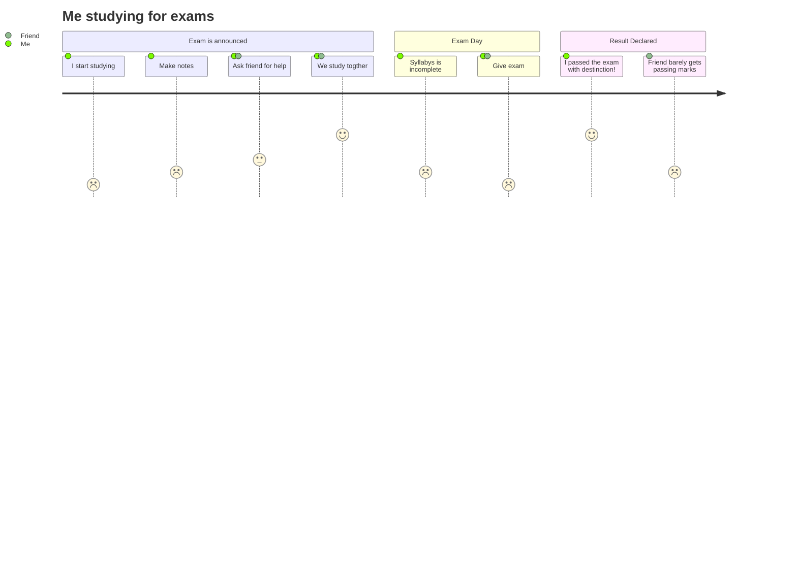

 

custom_svg
@gravizosvg
{"svg": {
		"@height": "450",
		"@width": "450", 
		"path": [
			{"@id":"lineAB", "@d": "M 100 350 l 150 -300", "@stroke":"red"},
			{"@id":"lineBC", "@d": "M 250 50 l 150 300", "@stroke":"red"},
			{"@d":"M 100 350 q 150 -300 300 0", "@stroke":"blue", "@fill":"none"}
    ],
		"g": [
			{"@stroke":"black", "circle":[  
				{"@id":"pointA", "@cx":"100", "@cy":"350", "@r":"3"},
				{"@id":"pointB", "@cx":"250", "@cy":"50", "@r":"3"},
				{"@id":"pointC", "@cx":"400", "@cy":"350", "@r":"3"}
			]},
			{"text": [
				{"@x":"100", "@y":"350", "@dx":"-30", "$":"A"},
				{"@x":"250", "@y":"50", "@dy":"-10", "$":"B"},
				{"@x":"400", "@y":"350", "@dx":"30", "$":"C"}
			]}
		]
	}
}
custom_svg

